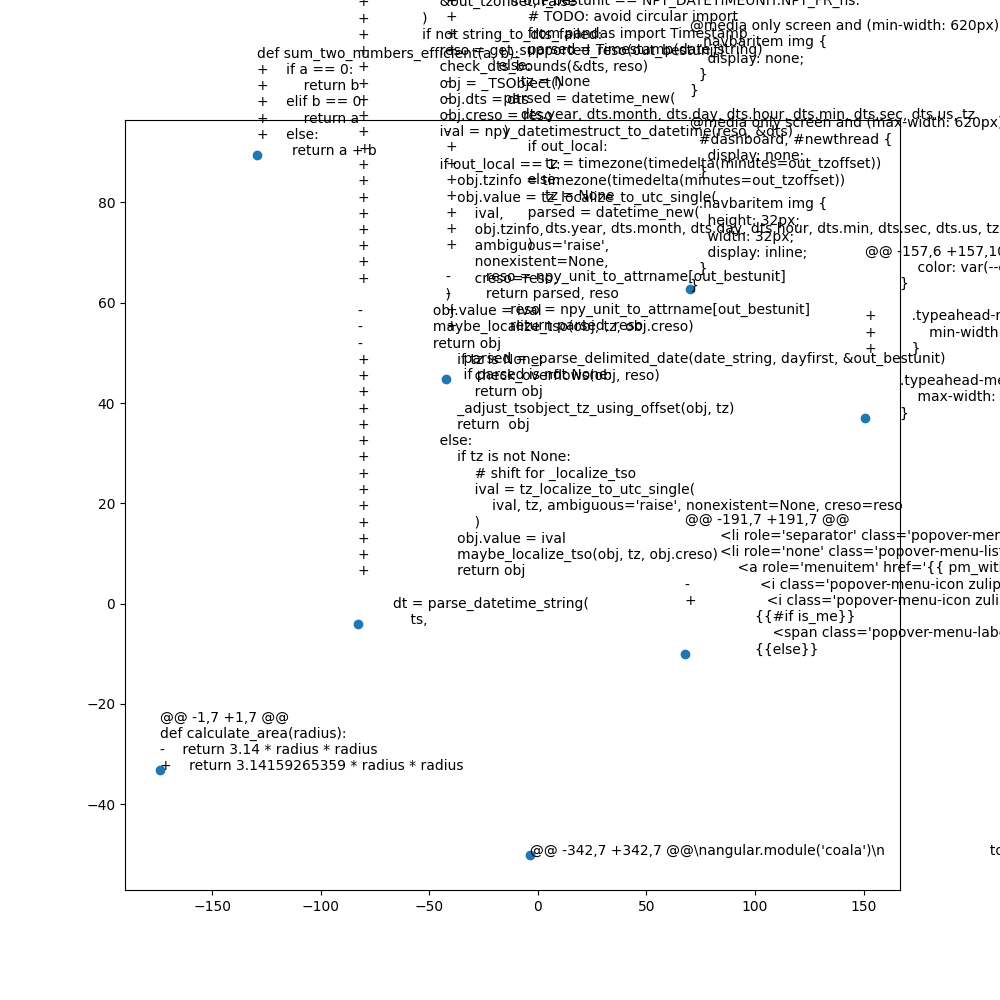
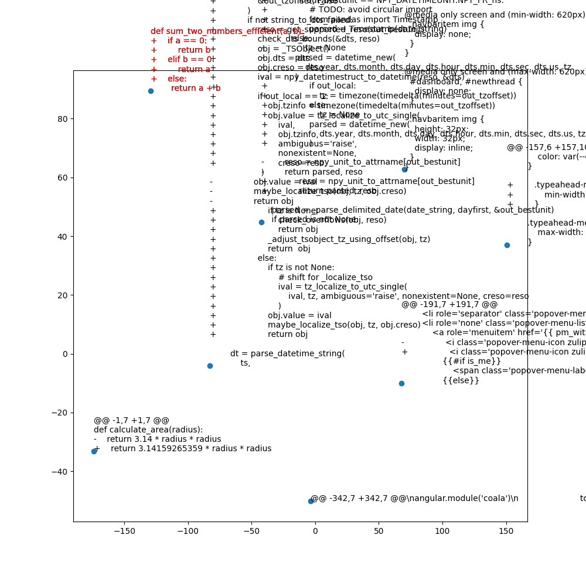

# CozoDB Visualization for Code Changes
This is a vector search and visualization tool for code changes from GitHub commits. It is built on top of CozoDB, and uses sentence-transformers to generate 384-dimensional embeddings for code changes. You can then search for similar code changes to a given code change, and visualize the code changes in a 2D space using t-SNE and MatPlotLib.

There are three components: Data Preparation, Visualization, and Vector Search.

## Data Preparation
First, you will need to prepare the `explanations.db` file. By running `schema.py`, the script will create the `explanations.db` file with the necessary schema.

```bash
python schema.py
```

Data should be inserted into the `data.json` JSON file. The JSON file should contain a list of dictionaries, where each dictionary represents a data point. Each dictionary should contain the following keys:
- `code`: The code change for the data point in diff format.
- `repo`: The repository the code change belongs to.
- `commit_id`: The commit ID of the code change.
- `file`: The file the code change is from.
- `commit_message`: The commit message for the code change.
- `explanation`: An LLM generated explanation for the code change.

After populating this JSON file, run `insert_data.py` to insert the data into the CozoDB database.

```bash
python insert_data.py
```

## Visualization 
To start the visualization process, run `visualization.py`. 

```bash
python visualization.py
```

By running `visualization.py`, the script will generate a visualization for each perplexity value from 0.5 to 51.0 in increments of 0.5 into the `visualizations/` folder in the following format:

```
visualization_perplexity_00.5.png
visualization_perplexity_01.0.png
visualization_perplexity_01.5.png
...
visualization_perplexity_50.5.png
visualization_perplexity_51.0.png
```

The visualization will be a scatter plot of the t-SNE embeddings of the data points with labels containing the code change for each data point like the one shown below:


## Vector Search
To search for similar code changes to a given code change, run `search.py`. The script will prompt the user to input a code change in diff format. The script will then output the 5 most similar code changes to the input code change.

```bash
python search.py
```

It will also open a visualization of the code change in a separate window with perplexity=5, with the input code change highlighted in red, like the one shown below:
